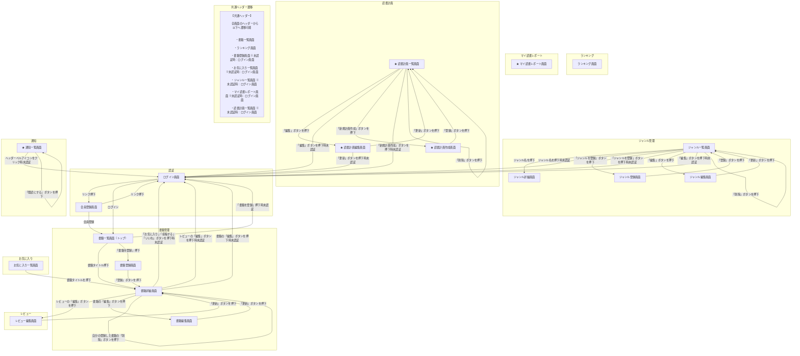

```mermaid
flowchart TD

    subgraph auth["認証"]
        login[ログイン画面]
        register[会員登録画面]
    end

    login -->|リンク押下| register
    register -->|リンク押下| login
    login -->|ログイン| books_index
    register -->|会員登録| books_index


    subgraph books["書籍管理"]
        books_index[書籍一覧画面（トップ）]
        books_show[書籍詳細画面]
        books_create[書籍登録画面]
        books_edit[書籍編集画面]
    end

    books_index -->|書籍タイトル押下| books_show
    books_index -->|「書籍を登録」押下| books_create
    books_index -->|「書籍を登録」押下時未認証| login
    books_show -->|「お気に入り」「投稿する」「いいね」ボタンを押下時未認証| login
    books_show -->|レビューの「編集」ボタンを押下| reviews_edit
    books_show -->|レビューの「編集」ボタンを押下時未認証| login
    books_show -->|書籍の「編集」ボタンを押下| books_edit
    books_show -->|書籍の「編集」ボタンを押下時未認証| login
    books_show -->|自分のレビューの「削除」ボタンを押下| books_show
    books_show -->|自分の登録した書籍の「削除」ボタンを押下| books_show
    books_create -->|「登録」ボタンを押下| books_show
    books_edit -->|「更新」ボタンを押下| books_show


    subgraph reviews["レビュー"]
        reviews_edit[レビュー編集画面]
    end

    reviews_edit -->|「更新」ボタンを押下| books_show


    subgraph favorites["お気に入り"]
        favorites_index[お気に入り一覧画面]
    end

    favorites_index -->|書籍タイトルを押下| books_show


    subgraph genres["ジャンル管理"]
        genres_index[ジャンル一覧画面]
        genres_create[ジャンル登録画面]
        genres_show[ジャンル詳細画面]
        genres_edit[ジャンル編集画面]
    end

    genres_index -->|ジャンル名を押下| genres_show
    genres_index -->|ジャンル名を押下時未認証| login
    genres_index -->|「ジャンルを登録」ボタンを押下| genres_create
    genres_index -->|「ジャンルを登録」ボタンを押下時未認証| login
    genres_index -->|「編集」ボタンを押下| genres_edit
    genres_index -->|「編集」ボタンを押下時未認証| login
    genres_index -->|「削除」ボタンを押下| genres_index
    genres_create -->|「登録」ボタンを押下| genres_index
    genres_edit -->|「更新」ボタンを押下| genres_index


    subgraph ranking["ランキング"]
        ranking_index[ランキング画面]
    end


    subgraph reports["マイ読書レポート"]
        reports_index[★ マイ読書レポート画面]
    end


    subgraph reading_plans["読書計画"]
        reading-plans_index[★ 読書計画一覧画面]
        reading-plans_create[★ 読書計画作成画面]
        reading-plans_edit[★ 読書計画編集画面]
    end

    reading-plans_index -->|「編集」ボタンを押下| reading-plans_edit
    reading-plans_index -->|「編集」ボタンを押下時未認証| login
    reading-plans_index -->|「新規計画作成」ボタンを押下| reading-plans_create
    reading-plans_index -->|「新規計画作成」ボタンを押下時未認証| login
    reading-plans_index -->|「読了する」ボタンを押下| reading-plans_index
    reading-plans_index -->|「削除」ボタンを押下| reading-plans_index
    reading-plans_create -->|「登録」ボタンを押下| reading-plans_index
    reading-plans_edit -->|「更新」ボタンを押下時未認証| login
    reading-plans_edit -->|「更新」ボタンを押下| reading-plans_index


    subgraph notifications["通知"]
        notifications_index[★ 通知一覧画面]
    end

    notifications_index -->|ヘッダーベルアイコンをクリック時未認証| login
    notifications_index -->|「既読にする」ボタンを押下| notifications_index


    subgraph 共通ヘッダー遷移
        header_note["【共通ヘッダー】<br/>
        全画面のヘッダーから以下へ遷移可能<br/><br/>
        ・書籍一覧画面<br/>
        ・ランキング画面<br/>
        ・書籍登録画面 ※未認証時：ログイン画面<br/>
        ・お気に入り一覧画面 ※未認証時：ログイン画面<br/>
        ・ジャンル一覧画面 ※未認証時：ログイン画面<br/>
        ・マイ読書レポート画面 ※未認証時：ログイン画面<br/>
        ・読書計画一覧画面 ※未認証時：ログイン画面"]
    end

```