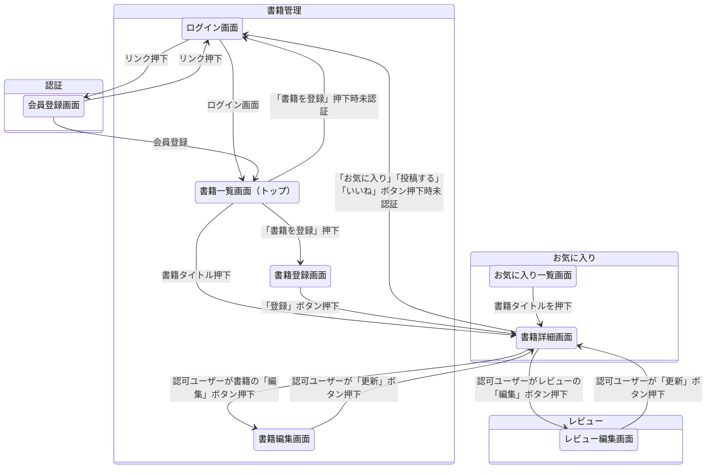

```mermaid
stateDiagram-v2
    state 認証 {
        state ログイン画面
        state 会員登録画面

        ログイン画面 --> 会員登録画面 : リンク押下
        会員登録画面 --> ログイン画面 : リンク押下
        ログイン画面 --> 書籍一覧画面（トップ） : ログイン画面
        会員登録画面 --> 書籍一覧画面（トップ） : 会員登録
    }

    state 書籍管理 {
        state 書籍一覧画面（トップ）
        state 書籍詳細画面
        state 書籍登録画面
        state 書籍編集画面

        書籍一覧画面（トップ） --> 書籍詳細画面 : 書籍タイトル押下
        書籍一覧画面（トップ） --> 書籍登録画面 : 「書籍を登録」押下
        書籍一覧画面（トップ） --> ログイン画面 : 「書籍を登録」押下時未認証
        書籍詳細画面 --> ログイン画面 : 「お気に入り」「投稿する」「いいね」ボタン押下時未認証
        書籍詳細画面 --> レビュー編集画面 : 認可ユーザーがレビューの「編集」ボタン押下
        書籍詳細画面 --> 書籍編集画面 : 認可ユーザーが書籍の「編集」ボタン押下
        書籍登録画面 --> 書籍詳細画面 : 「登録」ボタン押下
        書籍編集画面 --> 書籍詳細画面 : 認可ユーザーが「更新」ボタン押下
    }

    state レビュー {
        state レビュー編集画面
        レビュー編集画面 --> 書籍詳細画面 : 認可ユーザーが「更新」ボタン押下
    }

    state お気に入り {
        state お気に入り一覧画面
        お気に入り一覧画面 --> 書籍詳細画面 : 書籍タイトルを押下
    }

    
```